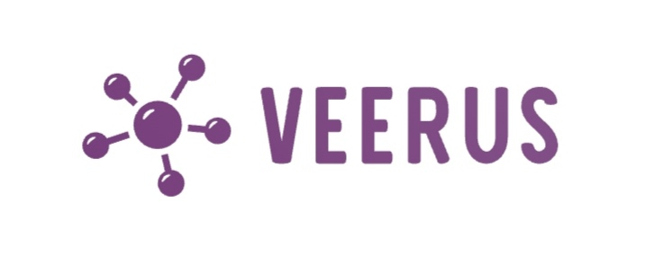

<!--
Hey, thanks for using the awesome-readme-template template.  
If you have any enhancements, then fork this project and create a pull request 
or just open an issue with the label "enhancement".

Don't forget to give this project a star for additional support ;)
Maybe you can mention me or this repo in the acknowledgements too
-->
<div align="center">

  
  <h1>Veerus</h1>
  <p>
The Best Multifunctional Computer Virus Including : RAT, Stealer, Miner
  </p>

<!-- About the Project -->
## :star2: About the Project
Veerus is a multifunctional virus including : RAT, Crypto Miner, Rdp, Stealers
<!-- Screenshots -->
### :camera: Screenshots

<div align="center"> 
  
</div>


<!-- Features -->
### :dart: Features
🔜 = Soon

💚 = Added

🚫 = Will never be added

🔜 Browser autofill, C r 3 d 1 t c 4 r d grabber

🔜 Integrated checker

🔜 Python code remote execution

🔜 Telegram sessions grabber

🔜 Camera stream


💚 Browser Password Stealer

💚 Discord Webhook Support

💚 Chrome Remote Desktop support <a href="https://remotedesktop.google.com/">(Link)</a>

💚 Hidden Crypto mining (RandomX) Use TRX for best performances.

💚 Discord logger + injection (password change...)

💚 Windows/Linux Browser cookies

💚 undetected by Smartscreen and Windows defender

💚 Fake Error

💚 Reverse shell

💚 Windows/Linux hidden crypto miner

💚 Victim Connexion / Logout Support

💚 Remote access Trojan (RAT, accès à distance 🇫🇷)

💚 And much more...


🚫 Arch Linux support cause I don't have this os and I have the flemme frère
<!-- Env Variables -->
### :key: Environment Variables

To run this project, you will need to add the following environment variables to your .env file

`API_KEY`

`ANOTHER_API_KEY`

<!-- Getting Started -->
## 	:toolbox: Getting Started

<!-- Prerequisites -->
### :bangbang: Prerequisites

This project uses Yarn as package manager

```bash
 npm install --global yarn
```

<!-- Installation -->
### :gear: Installation

Install my-project with npm

```bash
  yarn install my-project
  cd my-project
```
   
<!-- Running Tests -->
### :test_tube: Running Tests

To run tests, run the following command

```bash
  yarn test test
```

<!-- Run Locally -->
### :running: Run Locally

Clone the project

```bash
  git clone https://github.com/Louis3797/awesome-readme-template.git
```

Go to the project directory

```bash
  cd my-project
```

Install dependencies

```bash
  yarn install
```

Start the server

```bash
  yarn start
```


<!-- Deployment -->
### :triangular_flag_on_post: Deployment

To deploy this project run

```bash
  yarn deploy
```


<!-- Usage -->
## :eyes: Usage

Use this space to tell a little more about your project and how it can be used. Show additional screenshots, code samples, demos or link to other resources.


```javascript
import Component from 'my-project'

function App() {
  return <Component />
}
```

<!-- Roadmap -->
## :compass: Roadmap

* [x] Todo 1
* [ ] Todo 2


<!-- Contributing -->
## :wave: Contributing

<a href="https://github.com/Louis3797/awesome-readme-template/graphs/contributors">
  
</a>


Contributions are always welcome!

See `contributing.md` for ways to get started.


<!-- Code of Conduct -->
### :scroll: Code of Conduct

Please read the [Code of Conduct](https://github.com/Louis3797/awesome-readme-template/blob/master/CODE_OF_CONDUCT.md)

<!-- FAQ -->
## :grey_question: FAQ

- Question 1

  + Answer 1

- Question 2

  + Answer 2


<!-- License -->
## :warning: License

Distributed under the no License. See LICENSE.txt for more information.


<!-- Contact -->
## :handshake: Contact

Your Name - [@twitter_handle](https://twitter.com/twitter_handle) - email@email_client.com

Project Link: [https://github.com/Louis3797/awesome-readme-template](https://github.com/Louis3797/awesome-readme-template)


<!-- Acknowledgments -->
## :gem: Acknowledgements

Use this section to mention useful resources and libraries that you have used in your projects.

 - [Shields.io](https://shields.io/)
 - [Awesome README](https://github.com/matiassingers/awesome-readme)
 - [Emoji Cheat Sheet](https://github.com/ikatyang/emoji-cheat-sheet/blob/master/README.md#travel--places)
 - [Readme Template](https://github.com/othneildrew/Best-README-Template)
